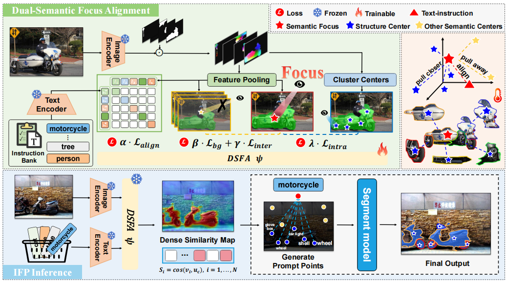

<div align="center">

<h1>Instruction-Focus-Prompt: Semantics-Driven Structural Prompts for Universal SAM Segmentation</h1>

Shuqi Xia<sup>1†</sup>, &nbsp; 
Guangze Shi<sup>1†</sup>, &nbsp; 
Jiarui Cao<sup>1</sup>, &nbsp;
Aoyuan Shi<sup>1</sup>, &nbsp;
Meilin Liu<sup>1</sup>, &nbsp;
Xiaoyi Zhang<sup>1</sup>, &nbsp;
Yujie Wang<sup>1</sup>, &nbsp;
Xueyu Liu<sup>1∗</sup>, &nbsp;
Cai Zhao<sup>1</sup>, &nbsp;
Yongfei Wu<sup>1</sup>, &nbsp;
Mingqiang Wei<sup>1∗</sup>, &nbsp;
Ziyuan He<sup>2</sup>

<sup>1</sup>[Taiyuan University of Technology](https://www.tyut.edu.cn/), &nbsp;
<sup>2</sup>[The University of Queensland](https://www.uq.edu.au/)

CVPR Findings

</div>

## 🚀 Overview
<div align="center">

</div>

## 📖 Description

The Segment Anything Model (SAM) has shown impressive performance across a wide range of segmentation tasks, but its effectiveness largely depends on the quality of user-provided prompts. In this paper, we introduce **Instruction-Focus-Prompt (IFP)**, a framework that enhances segmentation by aligning text instructions with semantic focus regions and transforming them into structural point prompts for SAM. For each segmentation target, IFP leverages DINOv3 features to generate a semantic focus that captures the core semantics of the target, along with a set of target structures that describe its constituent parts. Using contrastive learning, IFP pulls the focus closer to the target structures while pushing it away from the background. The refined focus is then aligned with the text instruction to form a unified representation that bridges visual and textual semantics. During segmentation, the learned unified representation enables the text features to guide the discovery of multiple target structures corresponding to the given instruction. Extensive experiments on natural and medical segmentation benchmarks show that IFP surpasses recent SAM-based methods, highlighting our method as a promising solution for text-guided segmentation.

## ℹ️ News

- Our paper accepted by CVPR Findings 2026!

## 📖 Recommanded Works

- Matcher: Segment Anything with One Shot Using All-Purpose Feature Matching. [GitHub](https://github.com/aim-uofa/Matcher)
- Talk2DINO: Talking to DINO: Bridging Self-Supervised Vision Backbones with Language for Open-Vocabulary Segmentation. [GitHub](https://github.com/lorebianchi98/Talk2DINO)
- GBMSeg: Feature-Prompting GBMSeg: One-Shot Reference Guided Training-Free Prompt Engineering for Glomerular Basement Membrane Segmentation. [GitHub](https://github.com/XueyuLiu/GBMSeg)
- PPO: Plug-and-Play PPO: An Adaptive Point Prompt Optimizer Making SAM Greater. [GitHub](https://github.com/XueyuLiu/PPO)
- dino.txt: DINOv2 Meets Text: A Unified Framework for Image- and Pixel-Level Vision-Language Alignment. [arXiv](https://arxiv.org/pdf/2412.16334)
- Trident: Harnessing Vision Foundation Models for High-Performance, Training-Free Open Vocabulary Segmentation. [GitHub](https://github.com/YuHengsss/Trident)

## 🗓️ TODO
- [x] Release pre-trained models


## 🏗️ Installation

See [installation instructions](INSTALL.md).


## 👻 Getting Started

### Prepare Models

Download the required pre-trained model weights:

- **DINOv3**: Download from [DINOv3 repository](https://github.com/facebookresearch/dinov3) and place weights under `dinov3/download_models/`
- **DINOv2**: Download from [DINOv2 repository](https://github.com/facebookresearch/dinov2) and place weights under `dinov2/download_models/`
- **CLIP**: Download from [HuggingFace](https://huggingface.co/openai) and place under `clip/`
- **SAM2**: Download [SAM2 checkpoints](https://github.com/facebookresearch/sam2) and place under `sam2/checkpoints/`

Or use our download scripts:
```bash
bash scripts/download_dino_models.sh
bash scripts/download_clip_models.sh
```

### Prepare Datasets

Organize datasets following the structure in `datasets/`. See [Preparing Datasets](datasets/README.md).

### Feature Extraction

```bash
python extract_features.py --config configs/extract_config.yaml
```

### Training

```bash
python train.py --config configs/train_config.yaml
```

### Inference

```bash
python inference.py --config configs/infer_config.yaml
```


### Qualitative Comparison
<div align="center">

</div>


## 🎫 License

For academic use, this project is licensed under the [2-clause BSD License](https://opensource.org/license/bsd-2-clause). For commercial use, please contact the corresponding authors.


## 🖊️ Citation

If you find this project useful in your research, please consider to cite:

```BibTeX
@inproceedings{xia2026instruction,
  title={Instruction-Focus-Prompt: Semantics-Driven Structural Prompts for Universal SAM Segmentation},
  author={Xia, Shuqi and Shi, Guangze and Cao, Jiarui and Shi, Aoyuan and Liu, Meilin and Zhang, Xiaoyi and Wang, Yujie and Liu, Xueyu and Zhao, Cai and He, Ziyuan and others},
  booktitle={Proceedings of the IEEE/CVF Conference on Computer Vision and Pattern Recognition},
  pages={7514--7519},
  year={2026}
}
```

## Acknowledgement
[SAM](https://github.com/facebookresearch/segment-anything), [SAM2](https://github.com/facebookresearch/sam2), [DINOv2](https://github.com/facebookresearch/dinov2), [DINOv3](https://github.com/facebookresearch/dinov3), [CLIP](https://github.com/openai/CLIP).
